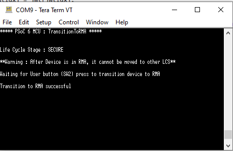

# PSoC™ 64 MCU: Transition to RMA

This example demonstrates how to transition the PSoC&trade; 64 MCU from "SECURED_CLAIMED" to the "RMA" lifecycle stage. The RMA lifecycle stage can be used by customers to return the parts to Infineon for failure analysis.

**CAUTION:** **After transitioning the PSoC&trade; 64 MCU into RMA stage, it cannot be converted back into other lifecycle stages.**

[View this README on GitHub.](https://github.com/Infineon/mtb-example-psoc6-transition-to-rma)

[Provide feedback on this code example.](https://cypress.co1.qualtrics.com/jfe/form/SV_1NTns53sK2yiljn?Q_EED=eyJVbmlxdWUgRG9jIElkIjoiQ0UyMzcxODQiLCJTcGVjIE51bWJlciI6IjAwMi0zNzE4NCIsIkRvYyBUaXRsZSI6IlBTb0PihKIgNjQgTUNVOiBUcmFuc2l0aW9uIHRvIFJNQSIsInJpZCI6Im5hcmF5YW5hdmFzdSIsIkRvYyB2ZXJzaW9uIjoiMS4wLjEiLCJEb2MgTGFuZ3VhZ2UiOiJFbmdsaXNoIiwiRG9jIERpdmlzaW9uIjoiTUNEIiwiRG9jIEJVIjoiSUNXIiwiRG9jIEZhbWlseSI6IlBTT0MifQ==)


## Requirements

- [ModusToolbox&trade; software](https://www.infineon.com/modustoolbox) v3.0 or later (tested with v3.0)
- Board support package (BSP) minimum required version: 4.0.0
- Programming language: C
- Other tools: Python 3.7.0 or later
- [cysecuretools 4.1.0](https://pypi.org/project/cysecuretools/)
- Associated parts: All PSoC™ 64 parts


## Supported toolchains (make variable 'TOOLCHAIN')

- GNU Arm&reg; Embedded Compiler v10.3.1 (`GCC_ARM`) – Default value of `TOOLCHAIN`
- Arm&reg; Compiler v6.16 (`ARM`)
- IAR C/C++ Compiler v9.30.1 (`IAR`)


## Supported kits (make variable 'TARGET')

- [PSoC 64 "Secure Boot" Wi-Fi pioneer kit](https://www.infineon.com/cms/en/product/evaluation-boards/cy8ckit-064b0s2-4343w/?utm_source=cypress&utm_medium=referral&utm_campaign=202110_globe_en_all_integration-dev_kit&redirId=VL1513) (`CY8CKIT-064B0S2-4343W`) – Default value of `TARGET`
- [PSoC 64 "Secure Boot" prototyping kit](https://www.infineon.com/cms/en/product/evaluation-boards/cy8cproto-064b0s3/?utm_source=cypress&utm_medium=referral&utm_campaign=202110_globe_en_all_integration-dev_kit&redirId=VL1531) (`CY8CPROTO-064B0S3`)
- [PSoC 64 "Secure Boot" prototyping kit](https://www.infineon.com/cms/en/product/evaluation-boards/cy8cproto-064s1-sb/) (`CY8CPROTO-064S1-SB`)

**Note:** See the ["Secure Boot" SDK user guide](https://www.infineon.com/dgdl/Infineon-PSoC_64_Secure_MCU_Secure_Boot_SDK_User_Guide-Software-v07_00-EN.pdf?fileId=8ac78c8c7d0d8da4017d0f8c361a7666&da=t) before starting work with a target enabled with "Secure Boot".

## Hardware setup

This example is used with PSoC™ 64 "Secure" MCU kits. To program and run the example on a PSoC™ 64 "Secure" MCU platform, the device must be provisioned with keys and policies, and then programmed with the signed firmware to boot up correctly.


## Software setup

Install a terminal emulator if you don't have one. Instructions in this document use [Tera Term](https://ttssh2.osdn.jp/index.html.en).

This example requires Python 3.7.0 and the 'cysecuretools' package to be installed.


### Install Python

For Windows, the installation of ModusToolbox 3.0 or later provides all the tools required to build, program, and provision devices. This includes the correct version of Python as well. Windows users may skip the remainder of this section.


#### **On Linux:**

Most distributions of Linux usually have Python 2 and Python 3 installed.

1. Verify that Python points to Python 3. Run the following command:

   ```
   > python --version
   ```

2. If Python is not installed on your machine, install it using the following command:

   ```
   > sudo apt install python3.7
   ```

3. Install pip. Run the following command:

   ```
   > sudo apt install python3-pip
   ```

4. Make sure that pip is using Python 3.7:

   ```
   > pip --version
   ```

#### **On macOS:**

1. Download and install the latest Python 3 release from https://www.python.org/downloads/mac-osx/.

2. Install pip:

   ```
   > python3 -m pip install --upgrade pip
   ```

### Install cysecuretools

1. Run the following command:

   ```
   > pip install cysecuretools
   ```


## Using the code example

Create the project and open it using one of the following:

<details><summary><b>In Eclipse IDE for ModusToolbox&trade; software</b></summary>

1. Click the **New Application** link in the **Quick Panel** (or, use **File** > **New** > **ModusToolbox&trade; Application**). This launches the [Project Creator](https://www.infineon.com/ModusToolboxProjectCreator) tool.

2. Pick a kit supported by the code example from the list shown in the **Project Creator - Choose Board Support Package (BSP)** dialog.

   When you select a supported kit, the example is reconfigured automatically to work with the kit. To work with a different supported kit later, use the [Library Manager](https://www.infineon.com/ModusToolboxLibraryManager) to choose the BSP for the supported kit. You can use the Library Manager to select or update the BSP and firmware libraries used in this application. To access the Library Manager, click the link from the Quick Panel.

   You can also just start the application creation process again and select a different kit.

   If you want to use the application for a kit not listed here, you may need to update the source files. If the kit does not have the required resources, the application may not work.

3. In the **Project Creator - Select Application** dialog, choose the example by enabling the checkbox.

4. (Optional) Change the suggested **New Application Name**.

5. The **Application(s) Root Path** defaults to the Eclipse workspace which is usually the desired location for the application. If you want to store the application in a different location, you can change the *Application(s) Root Path* value. Applications that share libraries should be in the same root path.

6. Click **Create** to complete the application creation process.

For more details, see the [Eclipse IDE for ModusToolbox&trade; user guide](https://www.infineon.com/MTBEclipseIDEUserGuide) (locally available at *{ModusToolbox&trade; software install directory}/docs_{version}/mt_ide_user_guide.pdf*).

</details>


<details><summary><b>In command-line interface (CLI)</b></summary>

ModusToolbox&trade; software provides the Project Creator as both a GUI tool and the command line tool, "project-creator-cli". The CLI tool can be used to create applications from a CLI terminal or from within batch files or shell scripts. This tool is available in the *{ModusToolbox&trade; software install directory}/tools_{version}/project-creator/* directory.

Use a CLI terminal to invoke the "project-creator-cli" tool. On Windows, use the command line "modus-shell" program provided in the ModusToolbox&trade; software installation instead of a standard Windows command-line application. This shell provides access to all ModusToolbox&trade; software tools. You can access it by typing `modus-shell` in the search box in the Windows menu. In Linux and macOS, you can use any terminal application.

The "project-creator-cli" tool has the following arguments:

Argument | Description | Required/optional
---------|-------------|-----------
`--board-id` | Defined in the `<id>` field of the [BSP](https://github.com/Infineon?q=bsp-manifest&type=&language=&sort=) manifest | Required
`--app-id`   | Defined in the `<id>` field of the [CE](https://github.com/Infineon?q=ce-manifest&type=&language=&sort=) manifest | Required
`--target-dir`| Specify the directory in which the application is to be created if you prefer not to use the default current working directory | Optional
`--user-app-name`| Specify the name of the application if you prefer to have a name other than the example's default name | Optional

<br>

The following example clones the "[PSoC6 MCU Transition To RMA](https://github.com/Infineon/mtb-example-psoc6-transition-to-rma)" application with the desired name "MyTransitionToRMA" configured for the *CY8CKIT-064B0S2-4343W* BSP into the specified working directory, *C:/mtb_projects*:

   ```
   project-creator-cli --board-id CY8CKIT-064B0S2-4343W --app-id mtb-example-psoc6-transition-to-rma --user-app-name MyTransitionToRMA --target-dir "C:/mtb_projects"
   ```

**Note:** The project-creator-cli tool uses the `git clone` and `make getlibs` commands to fetch the repository and import the required libraries. For details, see the "Project creator tools" section of the [ModusToolbox&trade; software user guide](https://www.infineon.com/ModusToolboxUserGuide) (locally available at *{ModusToolbox&trade; software install directory}/docs_{version}/mtb_user_guide.pdf*).

To work with a different supported kit later, use the [Library Manager](https://www.infineon.com/ModusToolboxLibraryManager) to choose the BSP for the supported kit. You can invoke the Library Manager GUI tool from the terminal using `make library-manager` command or use the Library Manager CLI tool "library-manager-cli" to change the BSP.

The "library-manager-cli" tool has the following arguments:

Argument | Description | Required/optional
---------|-------------|-----------
`--add-bsp-name` | Name of the BSP that should be added to the application | Required
`--set-active-bsp` | Name of the BSP that should be as active BSP for the application | Required
`--add-bsp-version`| Specify the version of the BSP that should be added to the application if you do not wish to use the latest from manifest | Optional
`--add-bsp-location`| Specify the location of the BSP (local/shared) if you prefer to add the BSP in a shared path | Optional

<br>

The following example adds the CY8CKIT-064B0S2-4343W BSP to the already created application and makes it the active BSP for the app:

   ```
   library-manager-cli --project "C:/mtb_projects/MyTransitionToRMA" --add-bsp-name CY8CKIT-064B0S2-4343W --add-bsp-version "latest-v4.X" --add-bsp-location "local"

   library-manager-cli --project "C:/mtb_projects/MyTransitionToRMA" --set-active-bsp CY8CKIT-064B0S2-4343W
   ```

</details>

<details><summary><b>In third-party IDEs</b></summary>

Use one of the following options:

- **Use the standalone [Project Creator](https://www.infineon.com/ModusToolboxProjectCreator) tool:**

   1. Launch Project Creator from the Windows Start menu or from *{ModusToolbox&trade; software install directory}/tools_{version}/project-creator/project-creator.exe*.

   2. In the initial **Choose Board Support Package** screen, select the BSP, and click **Next**.

   3. In the **Select Application** screen, select the appropriate IDE from the **Target IDE** drop-down menu.

   4. Click **Create** and follow the instructions printed in the bottom pane to import or open the exported project in the respective IDE.

<br>

- **Use command-line interface (CLI):**

   1. Follow the instructions from the **In command-line interface (CLI)** section to create the application.

   2. Export the application to a supported IDE using the `make <ide>` command.

   3. Follow the instructions displayed in the terminal to create or import the application as an IDE project.

For a list of supported IDEs and more details, see the "Exporting to IDEs" section of the [ModusToolbox&trade; user guide](https://www.infineon.com/ModusToolboxUserGuide) (locally available at *{ModusToolbox&trade; software install directory}/docs_{version}/mtb_user_guide.pdf*).

</details>


### Policy and keys

Add the policy that was used to provision the device into the *%WORKSPACE%/ApplicationName/policy* directory.


#### **Create the policy folder for the first time**

1. Ensure that you are in the *%WORKSPACE%/ApplicationName/* directory.

2. Execute the following command to finalize project initialization:

   ```
   > cysecuretools -t <kit-name> init
   ```

   For example, the following command finalizes the project initialization for the *CY8CKIT-064B0S2-4343W* kit:

   ```
   > cysecuretools -t cy8ckit-064b0s2-4343w init
   ```

   **Note:** After executing of the `init` command, all files that are required for application signing will be copied into the *%WORKSPACE%/ApplicationName/* directory, including the default policy for the chosen `<kit-name>`.


#### **Add the keys**

Add the keys that were used to provision the device into the *%WORKSPACE%/ApplicationName/keys* directory.

If you do not have the keys, generate default keys using the following command:

```
> cysecuretools -t <kit-name> -p <policy> create-keys
```

For example, the following command generates the default keys for the **CY8CKIT-064B0S2-4343W** kit:

```
> cysecuretools -t cy8ckit-064b0s2-4343w -p policy/policy_single_CM0_CM4_swap.json create-keys
```

**Note:** If you generate the keys, you must use these keys to provision your device. Otherwise, the example will not work correctly. See the "Generate new keys" section in the ["Secure Boot" SDK user guide](https://www.infineon.com/dgdl/Infineon-PSoC_64_Secure_MCU_Secure_Boot_SDK_User_Guide-Software-v07_00-EN.pdf?fileId=8ac78c8c7d0d8da4017d0f8c361a7666&da=t).


#### **Provision the device**

In this step, the *cysecuretools* application provisions the device based on the policy file. It performs the following three steps:

1. Reads the provided policy and forms the final provisioning packet, named "prov_cmt.jwt"

2. Performs the entrance exam to verify that the device has not been altered

3. Provisions the device by sending the *prov_cmd.jwt* packet to the PSoC&trade; 64 "Secure" MCU

   Before running this step, you may modify the default policy to match your end use case. For most development use cases, you don't need to modify it. See the SDK user guide for more information.

   **ATTENTION:** KitProg3 or the MiniProg4 must be in DAPLink mode. The kit supply voltage must be 2.5 V to perform this step. See the relevant kit user guide to learn how to change the supply voltage for your kit.

   ```
   > cysecuretools -t <kit-name> -p <policy> provision-device
   ```

   For example, the following command generates the default keys for the **CY8CKIT-064B0S2-4343W** kit:

   ```
   > cysecuretools -t cy8ckit-064b0s2-4343w -p policy/policy_single_CM0_CM4_swap.json provision-device
   ```


## Operation

1. Connect the board to your PC using the provided USB cable through the KitProg3 USB connector.

2. Open a terminal program and select the KitProg3 COM port. Set the serial port parameters to 8N1 and 115200 baud.

3. Program the board using one of the following:

   <details><summary><b>Using Eclipse IDE for ModusToolbox&trade; software</b></summary>

      1. Select the application project in the Project Explorer.

      2. In the Quick Panel, scroll down, and click **\<Application Name> Program (KitProg3_MiniProg4)**.
   </details>

   <details><summary><b>Using CLI</b></summary>

     From the terminal, execute the `make program` command to build and program the application using the default toolchain to the default target. The default toolchain is specified in the application's Makefile but you can override this value manually:
      ```
      make program TOOLCHAIN=<toolchain>
      ```

      Example:
      ```
      make program TOOLCHAIN=GCC_ARM
      ```
   </details>

4. After programming, the application starts automatically. Confirm that "***** PSoC 6 MCU : TransitionToRMA *****" is displayed on the UART terminal.

   **Figure 1. Terminal output on program startup**

   

   **Note:** During the bootup phase of the PSoC&trade; 64 MCU, you may see garbled data on the terminal emulator screen. This is because KitProg3's (PSoC&trade; 5LP device) debug UART RX input is not driven by the PSoC&trade; 64 MCU for a period of time.

   By default, the Infineon bootloader in the PSoC&trade; 64 MCU is in debug mode and will print out the bootloader status information. After this information is printed, the PSoC&trade; 64 TX GPIO is returned to its default High-Z state. Between the time the PSoC&trade; 64 TX GPIO pin is returned to High-Z state and when the PSoC&trade; 64 MCU application code reconfigures the GPIO pin, this signal may float and appear as UART data to the KitProg3 UART, which may be displayed as random characters on a terminal emulator.

   To eliminate this garbled data, add a 10k pull-down resistor between the PSoC&trade; 64 P5.1 GPIO and GND. This will pull the signal to GND while the PSoC&trade; 64 GPIO is High-Z and eliminate random noise causing invalid 1s and 0s to be detected by the KitProg3 UART.

5. Set the device voltage to 2.5 V to program eFuse to transition into RMA mode.

6. Press the user button (SW2) to transition the device into RMA mode.

   **CAUTION:** **After transitioning the PSoC&trade; 64 MCU into RMA stage, it cannot be converted back other lifecycle stage**


## Debugging

You can debug the example to step through the code. In the IDE, use the **\<Application Name> Debug (KitProg3_MiniProg4)** configuration in the **Quick Panel**. For details, see the "Program and debug" section in the [Eclipse IDE for ModusToolbox&trade; software user guide](https://www.infineon.com/MTBEclipseIDEUserGuide).

**Note:** **(Only while debugging)** On the CM4 CPU, some code in `main()` may execute before the debugger halts at the beginning of `main()`. This means that some code executes twice – once before the debugger stops execution, and again after the debugger resets the program counter to the beginning of `main()`. See [KBA231071](https://community.infineon.com/docs/DOC-21143) to learn about this and for the workaround.


See [PSoC&trade; 64 "Secure Boot" SDK user guide](https://www.infineon.com/dgdl/Infineon-PSoC_64_Secure_MCU_Secure_Boot_SDK_User_Guide-Software-v07_00-EN.pdf?fileId=8ac78c8c7d0d8da4017d0f8c361a7666&da=t) for details.


## Design and implementation

### Return Merchandise Authorization (RMA) mode

You can transition a device to the RMA mode (from SECURE_CLAIMED) when you want Infineon to perform failure analysis on the device. Before provisioning, the RMA section of the 'Debug' policy should be updated in the provisioning JWT file. This policy should include any areas of the flash that may contain proprietary code or sensitive data. This area will be erased automatically when the device transitions into RMA mode.

To place a device into RMA mode, the internal code must execute the `TransitionToRMA` system call. A JWT packet that contains the `DIE_ID` that is signed by a specified installed public key is passed as a parameter to the system call. The OEM has the option to pre-generate this packet and store it in the flash (as demonstrated in this example) or provide a method to generate and transfer it to the device through an OEM-defined interface. The `TransitionToRMA` system call is valid only when the device is in the SECURE_CLAIMED mode.

This example demonstrates the transitioning of PSoC&trade; 64 devices into RMA lifecycle stage by executing the `TransitionToRMA` system call. At the start of the application, it prints out the application title and waits for the user button to be pressed. Once the user button (SW2) is pressed, the device is transitioned into the RMA lifecycle stage.

The BSP Makefile's post-build command signs the application HEX image built with ModusToolbox&trade; so that the signed image can be programmed and run on PSoC&trade; 64 kits.

This example's source code is in the *main.c* file. The application's entry point is the `main()` function.

For details, see [PSoC&trade; 64 "Secure Boot" SDK user guide](https://www.infineon.com/dgdl/Infineon-PSoC_64_Secure_MCU_Secure_Boot_SDK_User_Guide-Software-v07_00-EN.pdf?fileId=8ac78c8c7d0d8da4017d0f8c361a7666&da=t)


### `TransitionToRMA` system call

This system call is implemented in this example as described in the [PSoC&trade; 64 technical reference manual](https://documentation.infineon.com/html/psoc6/zrs1651212645947.html).


### Generating the JWT packet required for the system call

After following the steps to provision the device,
In the *%WORKSPACE%/ApplicationName/packets* directory, the *control_dap_cert.json* file will be generated by *cysecuretools* during the provisioning steps. This file contains an "auth" packet with a valid `DIE_ID` range that was used to provision the device.

To convert it into a JWT file, execute the following command in the *%WORKSPACE%/ApplicationName/* directory:

```
> cysecuretools -t CY8CKIT-064B0S2-4343W -p policy/policy_single_CM0_CM4_swap.json sign-cert --json-file packets/control_dap_cert.json --key-id 5
```

**Note:** The key used to sign the JWT packet must be same the key specified in the `rma` section of the policy file used during provisioning. For more information, see the [PSoC&trade; 64 "Secure Boot" SDK user guide](https://www.infineon.com/dgdl/Infineon-PSoC_64_Secure_MCU_Secure_Boot_SDK_User_Guide-Software-v07_00-EN.pdf?fileId=8ac78c8c7d0d8da4017d0f8c361a7666&da=t)

The *control_dap_cert.jwt* file will be created in the same directory as the JSON file. Copy the contents of this JWT file into the *main.c* file of the application.


### Resources and settings

## Related resources

Resources  | Links
-----------|----------------------------------
Application notes  | [AN228571](https://www.infineon.com/AN228571) – Getting started with PSoC&trade; 6 MCU on ModusToolbox&trade; software <br>  [AN215656](https://www.infineon.com/AN215656) – PSoC&trade; 6 MCU: Dual-CPU system design <br>
Code examples  | [Using ModusToolbox&trade; software](https://github.com/Infineon/Code-Examples-for-ModusToolbox-Software) on GitHub
Device documentation | [PSoC&trade; 6 MCU datasheets](https://documentation.infineon.com/html/psoc6/bnm1651211483724.html) <br> [PSoC&trade; 6 technical reference manuals](https://documentation.infineon.com/html/psoc6/zrs1651212645947.html)<br>
Development kits | Select your kits from the [evaluation board finder](https://www.infineon.com/cms/en/design-support/finder-selection-tools/product-finder/evaluation-board)
Libraries on GitHub  | [mtb-pdl-cat1](https://github.com/Infineon/mtb-pdl-cat1) – PSoC&trade; 6 peripheral driver library (PDL)  <br> [mtb-hal-cat1](https://github.com/Infineon/mtb-hal-cat1) – Hardware abstraction layer (HAL) library <br> [retarget-io](https://github.com/Infineon/retarget-io) – Utility library to retarget STDIO messages to a UART port <br>
Middleware on GitHub  |  [psoc6-middleware](https://github.com/Infineon/modustoolbox-software#psoc-6-middleware-libraries) – Links to all PSoC&trade; 6 MCU middleware
Tools  | [Eclipse IDE for ModusToolbox&trade; software](https://www.infineon.com/modustoolbox) – ModusToolbox&trade; software is a collection of easy-to-use software and tools enabling rapid development with Infineon MCUs, covering applications from embedded sense and control to wireless and cloud-connected systems using AIROC&trade; Wi-Fi and Bluetooth&reg; connectivity devices. <br>


## Other resources

Infineon provides a wealth of data at www.infineon.com to help you to select the right device, and quickly and effectively integrate the device into your design.

For PSoC&trade; 6 MCU devices, see [How to Design with PSoC 6 MCU – KBA223067](https://community.infineon.com/t5/Knowledge-Base-Articles/How-to-Design-with-PSoC-6-MCU-KBA223067/ta-p/248857).


## Document history

Document title: *CE237184* – *PSoC™ 64 MCU: Transition to RMA*

 Version | Description of change
 ------- | ---------------------
 1.0.0   | New code example
 1.0.1   | Add support for CY8CPROTO-064S1-SB

<br>


---------------------------------------------------------

© Cypress Semiconductor Corporation, 2023. This document is the property of Cypress Semiconductor Corporation, an Infineon Technologies company, and its affiliates ("Cypress").  This document, including any software or firmware included or referenced in this document ("Software"), is owned by Cypress under the intellectual property laws and treaties of the United States and other countries worldwide.  Cypress reserves all rights under such laws and treaties and does not, except as specifically stated in this paragraph, grant any license under its patents, copyrights, trademarks, or other intellectual property rights.  If the Software is not accompanied by a license agreement and you do not otherwise have a written agreement with Cypress governing the use of the Software, then Cypress hereby grants you a personal, non-exclusive, nontransferable license (without the right to sublicense) (1) under its copyright rights in the Software (a) for Software provided in source code form, to modify and reproduce the Software solely for use with Cypress hardware products, only internally within your organization, and (b) to distribute the Software in binary code form externally to end users (either directly or indirectly through resellers and distributors), solely for use on Cypress hardware product units, and (2) under those claims of Cypress’s patents that are infringed by the Software (as provided by Cypress, unmodified) to make, use, distribute, and import the Software solely for use with Cypress hardware products.  Any other use, reproduction, modification, translation, or compilation of the Software is prohibited.
<br>
TO THE EXTENT PERMITTED BY APPLICABLE LAW, CYPRESS MAKES NO WARRANTY OF ANY KIND, EXPRESS OR IMPLIED, WITH REGARD TO THIS DOCUMENT OR ANY SOFTWARE OR ACCOMPANYING HARDWARE, INCLUDING, BUT NOT LIMITED TO, THE IMPLIED WARRANTIES OF MERCHANTABILITY AND FITNESS FOR A PARTICULAR PURPOSE.  No computing device can be absolutely secure.  Therefore, despite security measures implemented in Cypress hardware or software products, Cypress shall have no liability arising out of any security breach, such as unauthorized access to or use of a Cypress product. CYPRESS DOES NOT REPRESENT, WARRANT, OR GUARANTEE THAT CYPRESS PRODUCTS, OR SYSTEMS CREATED USING CYPRESS PRODUCTS, WILL BE FREE FROM CORRUPTION, ATTACK, VIRUSES, INTERFERENCE, HACKING, DATA LOSS OR THEFT, OR OTHER SECURITY INTRUSION (collectively, "Security Breach").  Cypress disclaims any liability relating to any Security Breach, and you shall and hereby do release Cypress from any claim, damage, or other liability arising from any Security Breach.  In addition, the products described in these materials may contain design defects or errors known as errata which may cause the product to deviate from published specifications. To the extent permitted by applicable law, Cypress reserves the right to make changes to this document without further notice. Cypress does not assume any liability arising out of the application or use of any product or circuit described in this document. Any information provided in this document, including any sample design information or programming code, is provided only for reference purposes.  It is the responsibility of the user of this document to properly design, program, and test the functionality and safety of any application made of this information and any resulting product.  "High-Risk Device" means any device or system whose failure could cause personal injury, death, or property damage.  Examples of High-Risk Devices are weapons, nuclear installations, surgical implants, and other medical devices.  "Critical Component" means any component of a High-Risk Device whose failure to perform can be reasonably expected to cause, directly or indirectly, the failure of the High-Risk Device, or to affect its safety or effectiveness.  Cypress is not liable, in whole or in part, and you shall and hereby do release Cypress from any claim, damage, or other liability arising from any use of a Cypress product as a Critical Component in a High-Risk Device. You shall indemnify and hold Cypress, including its affiliates, and its directors, officers, employees, agents, distributors, and assigns harmless from and against all claims, costs, damages, and expenses, arising out of any claim, including claims for product liability, personal injury or death, or property damage arising from any use of a Cypress product as a Critical Component in a High-Risk Device. Cypress products are not intended or authorized for use as a Critical Component in any High-Risk Device except to the limited extent that (i) Cypress’s published data sheet for the product explicitly states Cypress has qualified the product for use in a specific High-Risk Device, or (ii) Cypress has given you advance written authorization to use the product as a Critical Component in the specific High-Risk Device and you have signed a separate indemnification agreement.
<br>
Cypress, the Cypress logo, and combinations thereof, WICED, ModusToolbox, PSoC, CapSense, EZ-USB, F-RAM, and Traveo are trademarks or registered trademarks of Cypress or a subsidiary of Cypress in the United States or in other countries. For a more complete list of Cypress trademarks, visit www.infineon.com. Other names and brands may be claimed as property of their respective owners.
